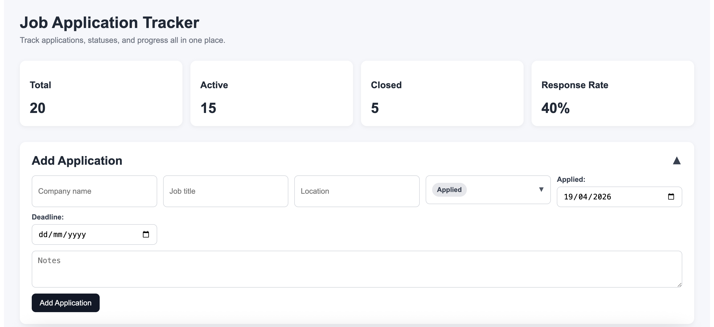
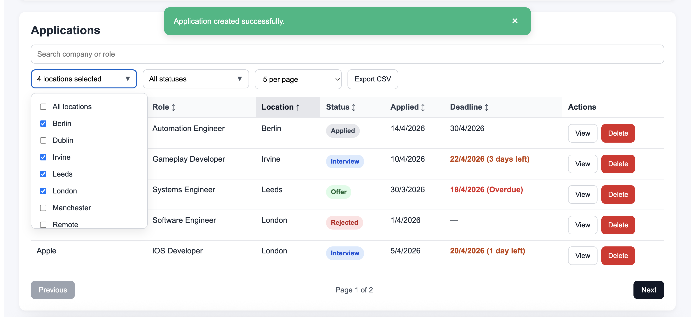
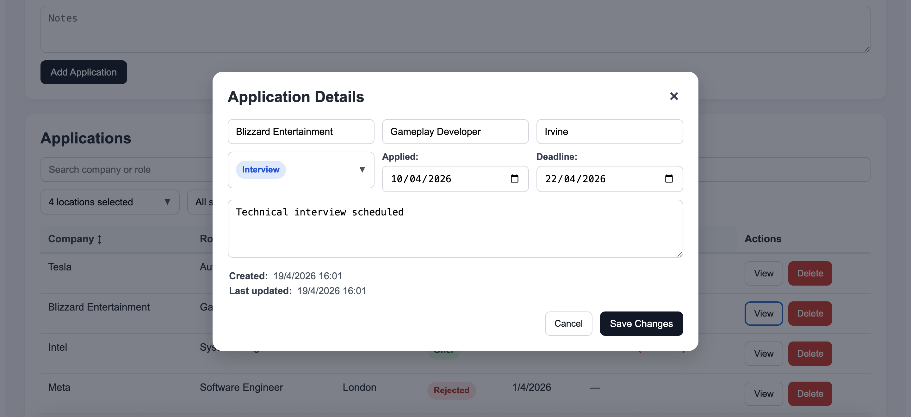

# 💼 Job Application Tracker (Full-Stack)

A full-stack web application for tracking job applications, built with FastAPI and React.  
This project focuses on clean architecture, structured backend design, and a polished, user-friendly frontend experience.

---

## ▶️ How to Run

### 1. Clone the repository
```bash
git clone https://github.com/michalsobr/JobApplicationTracker.git
cd JobApplicationTracker
```

### 2. Run Backend
```bash
python -m venv .venv
source .venv/bin/activate  # Mac/Linux
# .venv\Scripts\activate   # Windows

python -m pip install --upgrade pip
pip install -r requirements.txt
uvicorn app.main:app --reload
```

Alternatively, you can use the FastAPI CLI:
```bash
fastapi dev app/main.py
```

Backend runs at:
```
http://127.0.0.1:8000
```

### 3. Run Frontend
```bash
cd frontend
npm install
npm run dev
```

Frontend runs at:
```
http://localhost:5173
```

---

## 💡 Example Usage

- Add a new application with company, role, and location
- Filter by "Interview" status
- Select locations: Remote + London
- Sort by "Company"
- Export filtered results to CSV

---

## 🖼️ Screenshots

### 📊 Dashboard


### 🎯 Filters


### ✏️ View / Edit Application


---

## 🚀 Features

- ➕ Add new job applications
- ✏️ Edit existing applications (modal-based UI)
- 🗑️ Delete applications with confirmation
- 🔍 Search by company or role
- 🎯 Filter by:
  - Status (Applied, Interview, Offer, Rejected)
  - Location (multi-select, case-insensitive)
- ↕️ Sort by multiple fields (company, role, status, dates, etc.)
- 📄 Pagination (5 / 10 / 20 per page)
- 📊 Dashboard stats:
  - Total / Active / Closed
  - Response rate (based on Interview and Offer outcomes)
- ⏰ Deadline tracking:
  - Overdue (red)
  - Upcoming (≤ 7 days)
- 📤 Export filtered results to CSV
- 💬 Success / error feedback banner
- 🎨 Clean and responsive UI

---

## 🛠️ Technologies Used

### Backend
- FastAPI
- SQLAlchemy
- Pydantic
- SQLite
- Uvicorn

### Frontend
- React (Vite)
- JavaScript
- Inline CSS (custom styling)

---

## 📁 Project Structure

```text
JobApplicationTracker/
│
├── app/
│   ├── api/
│   │   └── routes/             # API endpoints
│   ├── core/                   # Database configuration
│   ├── crud/                   # Database operations
│   ├── models/                 # SQLAlchemy models
│   ├── schemas/                # Pydantic validation schemas
│   ├── services/               # Business logic layer
│   └── main.py                 # FastAPI entry point
│
├── frontend/
│   └── src/
│       └── App.jsx             # Main React application (single-page UI)
│
├── .venv/                      # Virtual environment (ignored by Git)
└── job_applications.db         # SQLite database (auto-generated, ignored by Git)
```

---

## 🧠 Architecture

The project follows a clean separation of concerns across backend and frontend:

### Backend
- **Routes (API layer)** → handle HTTP requests and responses
- **Service layer** → contains application-level logic
- **CRUD layer** → performs direct database operations
- **Schemas (Pydantic)** → validation and data structure
- **Models (SQLAlchemy)** → database representation

This ensures:
- Clear responsibility boundaries
- Easier debugging and maintenance
- Scalability for future extensions

### Frontend
- Single-page React application (App.jsx)
- State-driven UI (filters, sorting, pagination)
- Backend-driven data handling (sorting, filtering)
- Custom dropdowns and UI logic without external libraries

### Design focus
- Readability over complexity
- Minimal dependencies
- Clean and predictable state management

---

## 📚 What I Learned

- Designing a full-stack application with clear separation of concerns
- Structuring FastAPI projects with routes, services, and CRUD layers
- Implementing backend-driven filtering, sorting, and pagination
- Handling validation consistently across frontend and backend
- Building complex UI interactions in React without external libraries
- Managing multi-select filters and derived UI state
- Implementing real-world features like CSV export and deadline tracking
- Improving UX through feedback banners, empty states, and visual indicators
- Refactoring and organizing large files for readability and maintainability

---

## 📌 Future Improvements
- Authentication (user accounts)
- Dark mode UI
- Persistent user preferences (filters, sorting)
- Deployment (Docker / cloud hosting)
- Unit and integration tests

---

## 📄 License

This project is made for my portfolio, for educational purposes only.

---